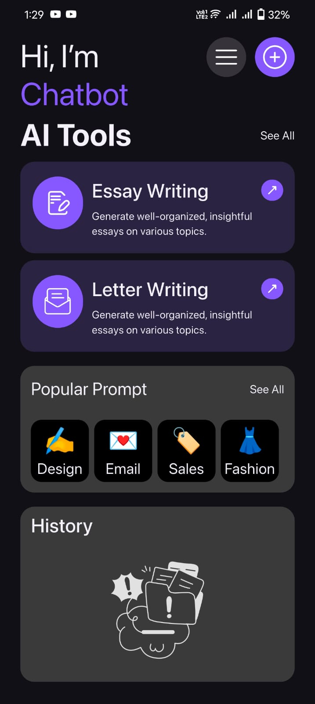
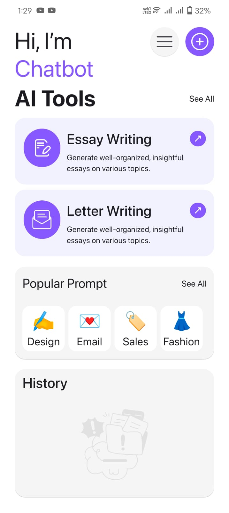
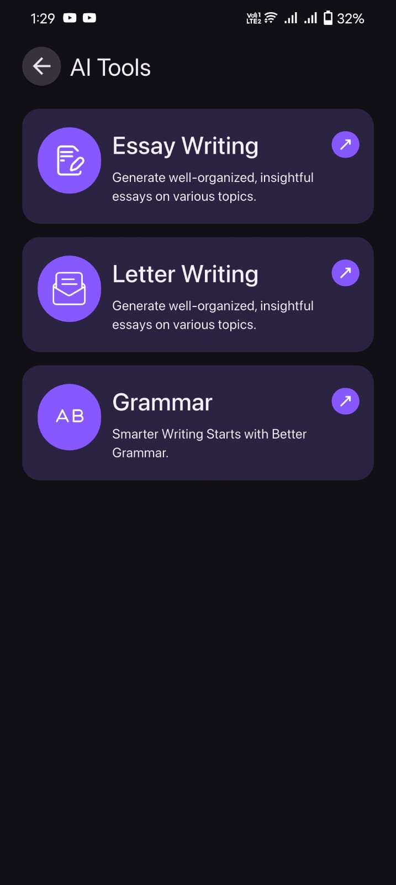
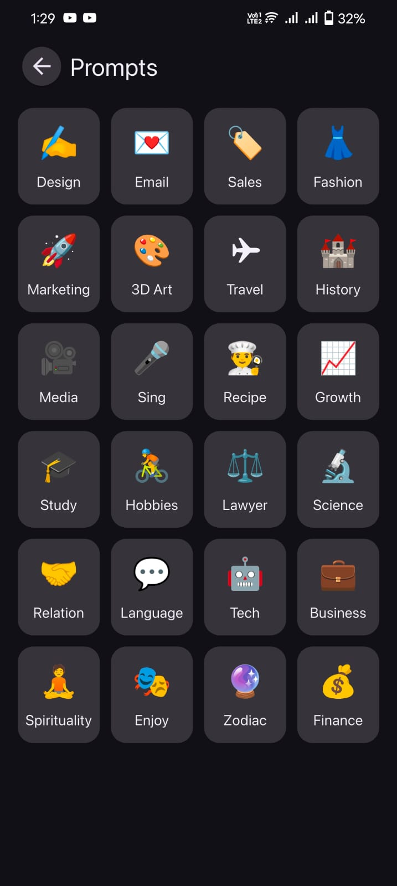

# AI Chatbot

A feature-rich **AI Chatbot built with Flutter**, focused on API integration, strong state management, local persistence, contextual conversations, and AI-powered utilities.

## ✨ Features

* 🤖 AI-powered conversations
* 💬 Context-aware chat with system prompts
* 🔄 Regenerate AI responses with version history
* 📋 Copy AI responses
* 📝 Grammar checking
* ✍️ Essay & letter generation
* 📄 Export responses to PDF
* 💾 Local conversation history
* 🗑️ Delete and clear conversations
* 🌐 REST API integration
* ⚙️ Loading, error & exception handling
* 📱 Clean and responsive UI

## 🛠️ Technologies

* **Flutter / Dart**
* **GetX** — State management
* **Dio** — API integration
* **Sqflite** — Local database
* **flutter_markdown_plus** — AI response rendering
* **PDF packages** — PDF generation & export
* **Lottie** — Animations

## 🧠 AI & Chat Architecture

The application manages:

* System prompts and instructions
* Conversation context
* API requests and responses
* Message states
* Response regeneration & versions
* Local conversation persistence
* Error and exception handling

## 📚 Key Concepts Practiced

* Flutter architecture
* State management with GetX
* REST API integration
* Local database & persistence
* Async programming
* AI API communication
* PDF generation
* Error handling
* Modular UI development

## 📸 Screenshots

  
  
  
   
 

## 👨‍💻 Developer

**Abdullah Rajput**
Flutter Developer
